<p align="center">
  
</p>

<h1 align="center">🌍 Climate-Health Early Warning Platform</h1>
<h3 align="center">Structures de santé solaires intelligentes & Alerte précoce climat-santé<br/>pour les enfants au Burkina Faso</h3>

<p align="center">
  
  
  
  
</p>

<p align="center">
  
  
  
  
  
</p>

<p align="center">
  <a href="https://www.youtube.com/watch?v=q4LzMIX8rJ4">
    
  </a>
</p>

---

## 🎬 Platform Screenshots

### Dashboard — Real-time KPIs & Overview
> Main dashboard showing operational status of all 10 health centers, active alerts, children covered, energy production, cold chain integrity, water availability, and vaccination coverage at a glance.

<p align="center">
  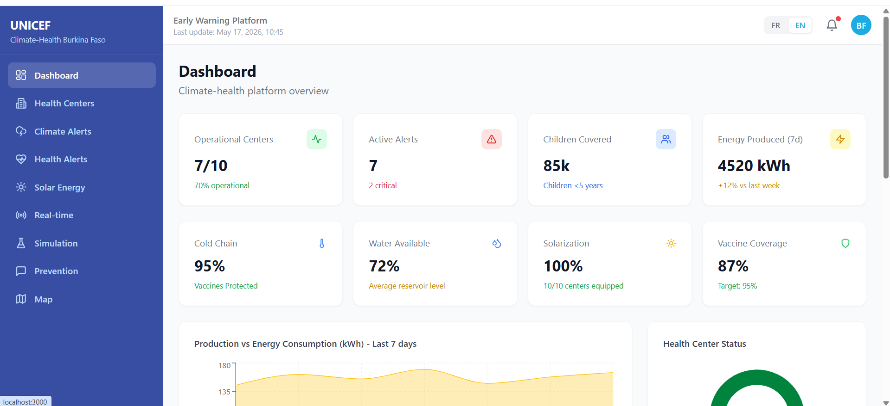
</p>

---

### Climate Alerts — Early Warning System
> AI-powered climate alert management with severity classification (Critical/High/Medium), affected population counts, date ranges, and actionable recommendations for health workers. Fully translated in English.

<p align="center">
  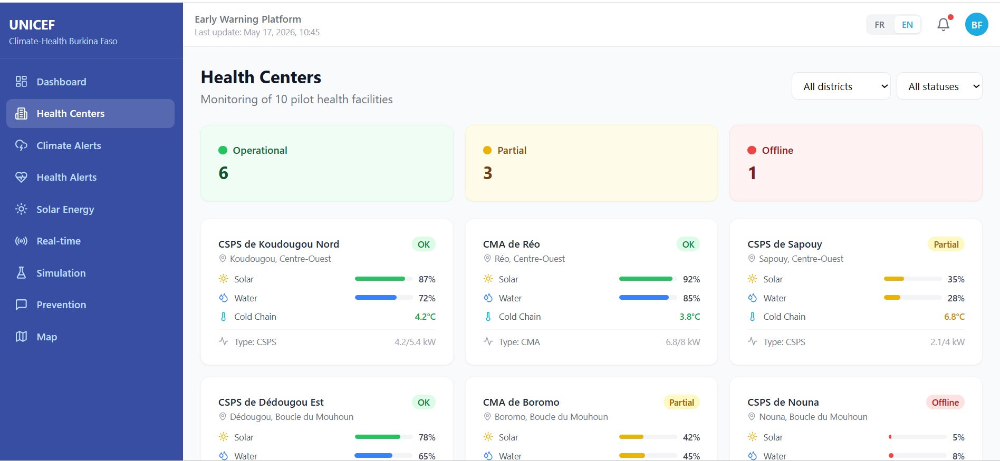
</p>

---

### Health Center Detail — Solar, Water & Cold Chain Monitoring
> Detailed view of an individual health center showing 7-day solar production chart, system specifications (panel count, capacity, efficiency), water system status (WASH), and cold chain temperature with vaccine stock tracking.

<p align="center">
  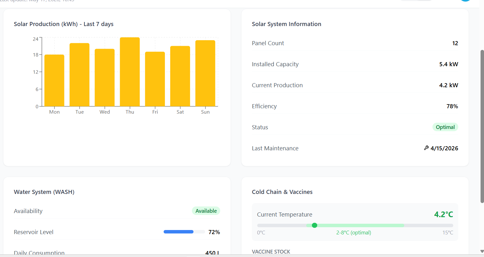
</p>

---

### Health Centers — Monitoring 10 Pilot Facilities
> Grid view of all pilot health centers with real-time status indicators (Operational/Partial/Offline), solar battery levels, water reservoir percentages, and cold chain temperatures. Filterable by district and status.

<p align="center">
  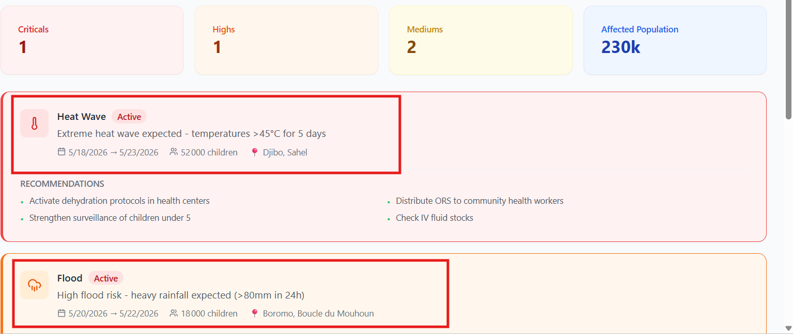
</p>

---

### Health Alerts — Epidemiological Surveillance
> Disease outbreak tracking with case counts, children affected, trend indicators (increasing/stable/decreasing), and recommended actions. Covers malaria, malnutrition, dehydration, and respiratory infections.

<p align="center">
  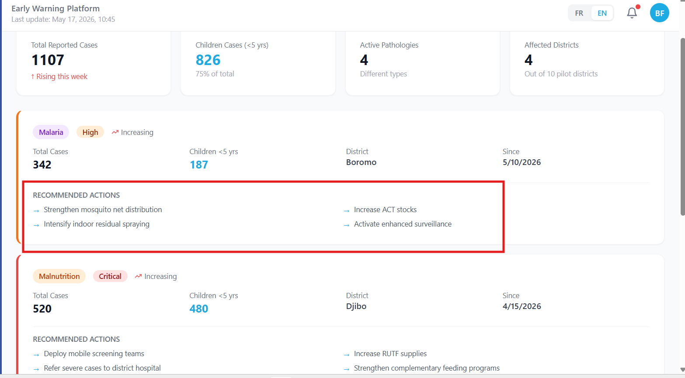
</p>

---

### Energy Monitoring — Solar Production Analytics
> Hourly solar production curve showing the daily generation pattern, weekly production comparison by center, and battery level rankings. Identifies centers needing maintenance (Nouna at 5% — critical).

<p align="center">
  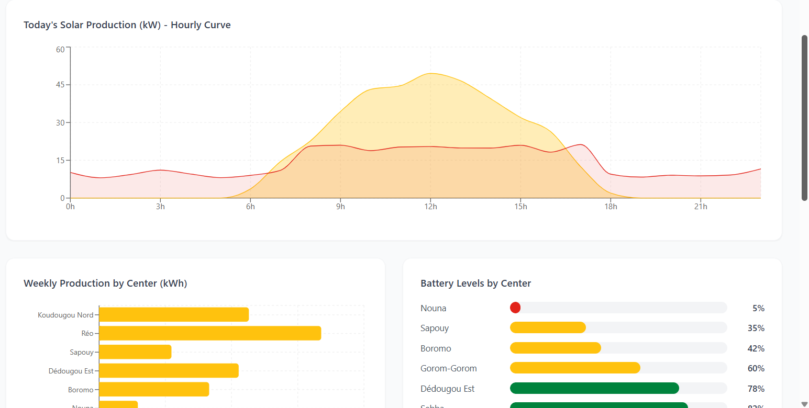
</p>

---

### Real-time Monitoring — Live IoT Sensor Data
> Live sensor data table updating every 3 seconds showing all 10 centers with connection status, solar production, battery %, water level, cold chain temperature, ambient temperature, and energy consumption.

<p align="center">
  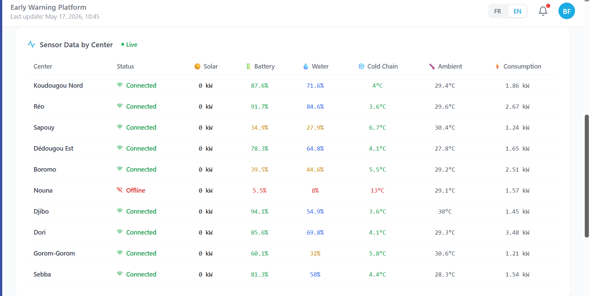
</p>

---

### Simulation — Crisis Scenario Configuration
> Monte Carlo crisis simulator allowing selection of crisis type (Heat Wave, Flood, Drought, Epidemic), intensity level, duration (3–30 days), and affected districts. Runs 100 simulations for confidence intervals.

<p align="center">
  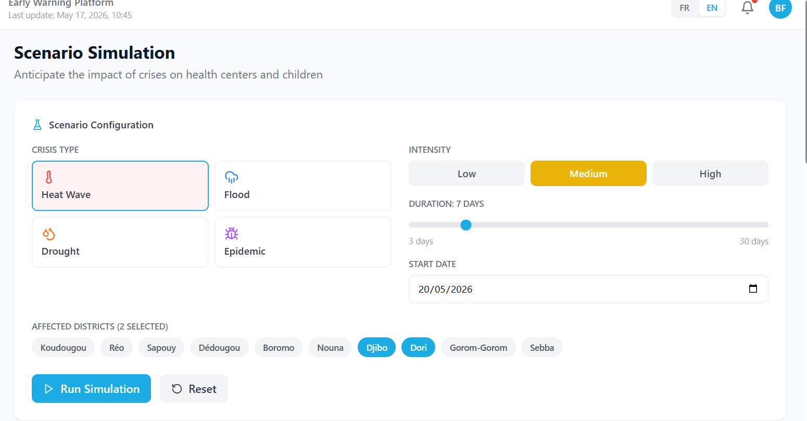
</p>

---

### Simulation Results — Impact Assessment
> Simulation output showing estimated impact: 9,600 children at risk, 3 centers impacted, 420 kWh energy deficit, 16.8k liters water deficit, 2 cold chain breaks. Includes energy/water evolution curves and health risk trajectory.

<p align="center">
  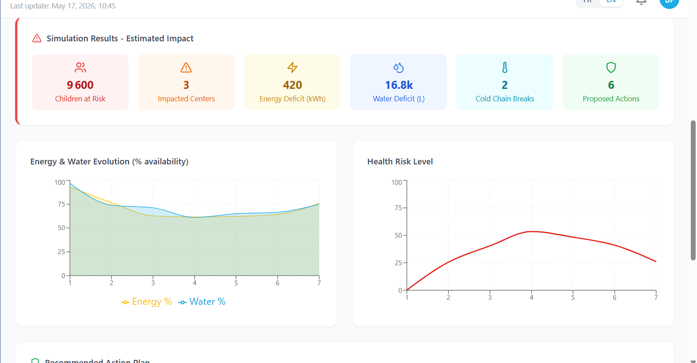
</p>

---

### Simulation — Recommended Action Plan
> AI-generated action plan with 6 prioritized interventions (pre-position ORS, activate heat protocols, reinforce batteries, deploy mobile teams, broadcast messages, check cold chain). Shows potentially affected health centers with current status.

<p align="center">
  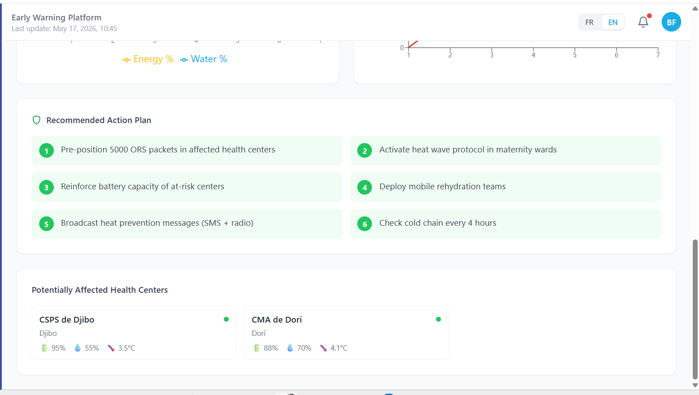
</p>

---

### Prevention Messages — Multilingual Community Broadcasting
> Message management system showing SMS/voice messages sent to mothers and health workers in 4 local languages (Mooré, Dioula, Fulfuldé, French). Automatic triggers based on climate thresholds. 46,765 messages sent this month reaching ~47k beneficiaries.

<p align="center">
  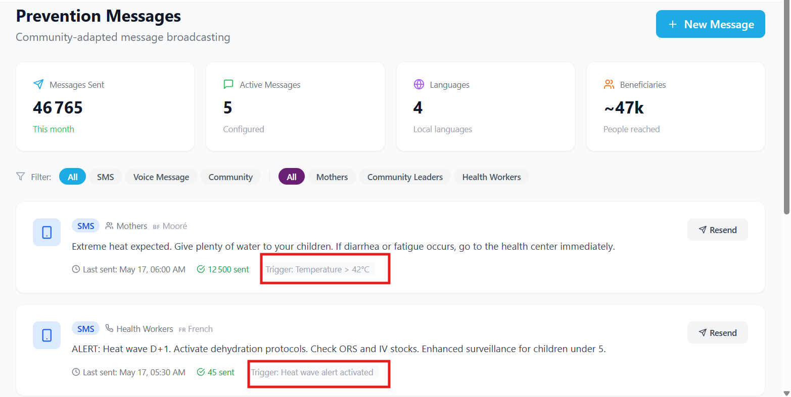
</p>

---

### Interactive Map — Geographic Visualization
> Map of Burkina Faso showing health center locations with status indicators, climate alert zones (animated pulse for active threats), and active alerts panel listing heat waves, floods, storms, and disease outbreaks with affected children counts.

<p align="center">
  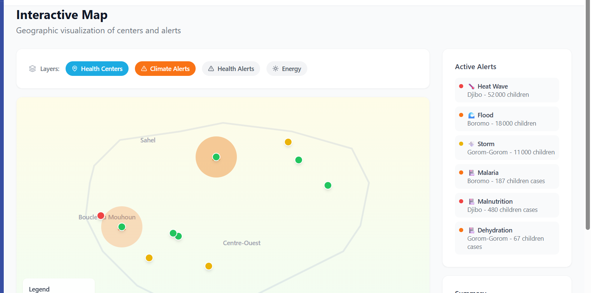
</p>

---

## 📋 Overview

An integrated open-source platform combining **smart solar-powered health facilities** with a **climate-health early warning system** to ensure continuity of care and strengthen health system resilience for vulnerable children in Burkina Faso.

> 🎯 **Pilot Phase**: 10 health centers across 3 priority districts (Sahel, Boucle du Mouhoun, Centre-Ouest)  
> 👶 **Target**: Children under 5 and pregnant women  
> 🌡️ **Context**: 4.4M people affected by humanitarian crisis, including 2.3M children

---

## ✨ Key Features

### 🏥 Smart Health Center Monitoring
- Real-time solar energy production & battery tracking
- Water system (WASH) monitoring with reservoir levels
- Cold chain temperature surveillance for vaccine protection
- Automatic alerts when thresholds are exceeded

### 🌦️ Climate-Health Early Warning
- Combined analysis of climate and health data
- AI-powered epidemic prediction (malaria, malnutrition, dehydration)
- Multi-hazard climate risk assessment (heat waves, floods, drought)
- Real-time alerts for health authorities and community workers

### 📱 Multilingual Prevention Messaging
- SMS/voice messages in **4 local languages** (French, Mooré, Dioula, Fulfuldé)
- Culturally-adapted content for different audiences
- Automatic trigger based on climate/health thresholds
- AI-powered translation engine

### 🧪 Crisis Simulation
- Monte Carlo simulation of crisis scenarios
- Cascade effect analysis (energy → cold chain → vaccines)
- Resource needs estimation and cost projections
- Action plan generation

### 🤖 AI/ML Models
| Model | Architecture | Purpose | Accuracy |
|-------|-------------|---------|----------|
| Epidemic Predictor | Bi-LSTM + Attention | Disease outbreak forecasting | F1: 0.83 |
| Energy Forecaster | XGBoost + LSTM Hybrid | Solar production prediction | R²: 0.92 |
| Climate Risk Model | Random Forest + Bayesian | Multi-hazard risk assessment | AUC: 0.91 |
| Translation Engine | mBART Transformer | FR ↔ Mooré ↔ Dioula ↔ Fulfuldé | BLEU: 34.7 |

---

## 🏗️ Architecture

```
┌─────────────────────────────────────────────────────────────────┐
│                        FRONTEND (React + TypeScript)              │
│  ┌──────────┐ ┌──────────┐ ┌──────────┐ ┌──────────┐           │
│  │Dashboard │ │Real-time │ │Simulation│ │   Map    │           │
│  │  KPIs    │ │ Sensors  │ │  Engine  │ │  View    │  ...      │
│  └──────────┘ └──────────┘ └──────────┘ └──────────┘           │
└────────────────────────────┬────────────────────────────────────┘
                             │ REST API
┌────────────────────────────┴────────────────────────────────────┐
│                     BACKEND (FastAPI + Python)                    │
│  ┌────────────────┐  ┌────────────────┐  ┌────────────────┐    │
│  │  Sensor API    │  │  Alert Engine  │  │  Predictions   │    │
│  │  (IoT data)    │  │  (thresholds)  │  │  (AI models)   │    │
│  └────────────────┘  └────────────────┘  └────────────────┘    │
│  ┌────────────────┐  ┌────────────────┐  ┌────────────────┐    │
│  │  Translation   │  │  Simulation    │  │   Scheduler    │    │
│  │  Engine (NLP)  │  │  (Monte Carlo) │  │  (background)  │    │
│  └────────────────┘  └────────────────┘  └────────────────┘    │
└────────────────────────────┬────────────────────────────────────┘
                             │
┌────────────────────────────┴────────────────────────────────────┐
│                    IoT SENSORS (10 Health Centers)                │
│  ☀️ Solar panels  💧 Water pumps  ❄️ Cold chain  🌡️ Temperature  │
└─────────────────────────────────────────────────────────────────┘
```

---

## 🚀 Quick Start

### Prerequisites
- **Node.js** ≥ 18
- **Python** ≥ 3.10
- **npm** or **yarn**

### Frontend

```bash
# Install dependencies
npm install

# Start development server
npm run dev

# Build for production
npm run build
```

Access at: **http://localhost:5173**

### Backend

```bash
cd server

# Install Python dependencies
pip install -r requirements.txt

# Start API server
uvicorn main:app --reload --port 8000
```

Access at: **http://localhost:8000/docs** (Swagger UI)

### Sensor Simulator

```bash
cd server

# Simulate IoT sensor data (sends to API every 30s)
python scripts/sensor_simulator.py --interval 30
```

---

## 📁 Project Structure

```
Unicef_2026/
├── 📂 src/                          # Frontend (React + TypeScript)
│   ├── 📂 components/               # Reusable UI components
│   │   └── Layout.tsx               # Main layout with navigation
│   ├── 📂 pages/                    # Application pages
│   │   ├── Dashboard.tsx            # Main KPI dashboard
│   │   ├── HealthCenters.tsx        # Health center list
│   │   ├── HealthCenterDetail.tsx   # Individual center detail
│   │   ├── ClimateAlerts.tsx        # Climate alert management
│   │   ├── HealthAlertsPage.tsx     # Health alert management
│   │   ├── EnergyMonitoring.tsx     # Solar energy monitoring
│   │   ├── RealtimeMonitoring.tsx   # Live sensor data view
│   │   ├── Simulation.tsx           # Crisis simulation tool
│   │   ├── Prevention.tsx           # Prevention messaging
│   │   └── MapView.tsx              # Geographic visualization
│   ├── 📂 i18n/                     # Internationalization (FR/EN)
│   │   ├── translations.ts         # Translation strings
│   │   └── LanguageContext.tsx      # Language provider
│   ├── 📂 data/                     # Mock data
│   │   └── mockData.ts             # Simulated health center data
│   └── 📂 types/                    # TypeScript type definitions
│       └── index.ts                 # All interfaces
│
├── 📂 server/                       # Backend (Python + FastAPI)
│   ├── main.py                      # API entry point
│   ├── 📂 app/
│   │   ├── 📂 api/                  # REST endpoints
│   │   │   ├── sensors.py           # IoT data reception
│   │   │   ├── alerts.py            # Alert system
│   │   │   ├── predictions.py       # AI prediction API
│   │   │   ├── translations.py      # Translation API
│   │   │   └── simulation.py        # Simulation API
│   │   ├── 📂 models/               # Database models
│   │   ├── 📂 services/             # Business logic
│   │   │   ├── alert_engine.py      # Threshold-based alerts
│   │   │   └── scheduler.py         # Background tasks
│   │   ├── 📂 translation_engine/   # 🌐 NLP Translation Module
│   │   │   ├── translator.py        # Multi-language translator
│   │   │   └── language_detector.py # Auto language detection
│   │   ├── 📂 simulation_models/    # 🧪 Crisis Simulation
│   │   │   ├── crisis_simulator.py  # Monte Carlo simulator
│   │   │   └── impact_model.py      # Cascade effect model
│   │   └── 📂 prediction_models/    # 🤖 AI/ML Models
│   │       ├── epidemic_predictor.py    # LSTM epidemic model
│   │       ├── energy_forecaster.py     # Solar prediction model
│   │       ├── climate_risk_model.py    # Climate risk model
│   │       └── train_models.py          # Training pipeline
│   └── 📂 scripts/
│       └── sensor_simulator.py      # IoT sensor simulator
│
├── package.json
├── tailwind.config.js
├── tsconfig.json
└── vite.config.ts
```

---

## 🌐 API Reference

### Sensor Data
```http
POST /api/v1/sensors/data
Content-Type: application/json

{
  "center_id": "cs-001",
  "sensor_type": "battery_level",
  "value": 85.5,
  "unit": "%",
  "latitude": 12.2533,
  "longitude": -2.3628
}
```

### Translation
```http
POST /api/v1/translations/translate
Content-Type: application/json

{
  "text": "Donnez beaucoup d'eau à vos enfants",
  "source_language": "fr",
  "target_language": "moore",
  "domain": "health"
}
```

### Epidemic Prediction
```http
POST /api/v1/predictions/epidemic
Content-Type: application/json

{
  "districts": ["Djibo", "Dori"],
  "horizon_days": 14
}
```

### Crisis Simulation
```http
POST /api/v1/simulation/run
Content-Type: application/json

{
  "scenario": "heat_wave",
  "intensity": "high",
  "duration_days": 7,
  "affected_districts": ["Djibo", "Dori"],
  "start_date": "2026-05-20",
  "monte_carlo_runs": 100
}
```

---

## 🌍 Languages Supported

| Language | Code | Speakers in BF | Usage |
|----------|------|---------------|-------|
| 🇫🇷 Français | `fr` | ~25% | Official, health workers |
| 🇧🇫 Mooré | `moore` | ~50% | Mossi communities |
| 🇧🇫 Dioula | `dioula` | ~15% | West African trade language |
| 🇧🇫 Fulfuldé | `fulfulde` | ~10% | Sahel pastoral communities |

The platform UI supports **French** and **English**. Prevention messages are generated in all 4 local languages.

---

## 📊 Dashboard Pages

| Page | Description |
|------|-------------|
| **Dashboard** | KPIs, charts, alert overview, center status |
| **Health Centers** | List of 10 pilot facilities with status indicators |
| **Climate Alerts** | Early warning system with alert creation form |
| **Health Alerts** | Epidemiological surveillance with case reporting |
| **Energy Monitoring** | Solar production, battery levels, efficiency |
| **Real-time** | Live sensor data with auto-refresh (3s interval) |
| **Simulation** | Crisis scenario modeling with Monte Carlo |
| **Prevention** | Multilingual message management |
| **Map** | Geographic visualization with layer controls |

---

## 🔗 Alignment with UNICEF Venture Fund

This project addresses key Venture Fund priorities:

- ✅ **Early Warning** — AI-powered prediction of climate and health risks
- ✅ **Health System Resilience** — Solar-powered infrastructure continuity
- ✅ **Technological Innovation** — IoT sensors, ML models, NLP translation
- ✅ **Open Source** — Digital Public Good with open APIs and documentation
- ✅ **Data Protection** — Compliant with UNICEF data protection principles
- ✅ **Interoperability** — RESTful APIs, standard data formats

---

## 🤝 Partnerships

| Partner | Role |
|---------|------|
| **UNICEF** | Project leadership & coordination |
| **Government (MoH)** | Health system integration |
| **Tech Startups** | Platform development |
| **Local Communities** | Co-design & feedback |

---

## 📈 Expected Impact

- 📉 Reduce service interruptions in health facilities
- 👶 Decrease preventable child mortality
- ⚡ Ensure 24/7 energy for vaccine cold chain
- 🚨 Anticipate crises 48-72h in advance
- 📱 Reach 47,000+ people with prevention messages

---

## 📄 License

This project is licensed under the **MIT License** — it is developed as a **Digital Public Good** with open code, interoperable APIs, and public documentation.

---

<p align="center">
  <strong>Built with ❤️ for the children of Burkina Faso in collaboration with UNICEF BURKINA FASO</strong><br/>
  <sub>GO AI CORP— 2026</sub>
</p>
